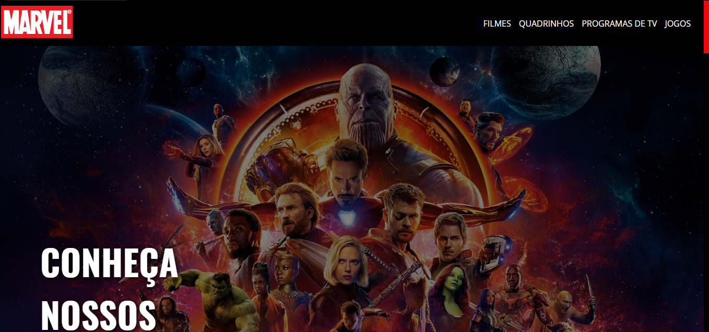

<h1 align="center">
    
    <br>
    Marvel Characters Front end challenge
</h1>

<h4 align="center">
  Obrigado Viajar Faz Bem pela oportunidade, segue abaixo as informações do teste
</h4>

<p align="center">
  <a href="https://yeidlstreet-survey.netlify.app/">
    
  </a>
</p>

<p align="center">
  <a href="https://marvel-characters-test.netlify.app/">
    
  </a>
</p>

## :rocket: Funcionalides

Página responsiva :heavy_check_mark:

Carrossel contendo os seguintes personagens:
- Homem Aranha :heavy_check_mark:
- Viúva Negra :heavy_check_mark:
- Hulk :heavy_check_mark:
- Thor :heavy_check_mark:
- Pantera Negra :heavy_check_mark:
- Thanos :heavy_check_mark:
- Homem de Ferro :heavy_check_mark:

Funcionalidades extras: 

- Modal com Detalhes de um pesronagem. :heavy_check_mark:
- Pesquisa de personagem por nome. :heavy_check_mark:

## :rocket: Tecnologias

- [ReactJS](https://reactjs.org/)
- [Typescript][ts]
- [styled-components](https://www.styled-components.com/)
- [react-reveal](https://www.react-reveal.com/)
- [VS Code][vscode] 

## Principais desafios: 

Um dos principais desafios foi trazer os personagens solicitados e colocá-los no carrosel, tive que utilizar o Promisse.all do javascript para obter cada personagem e obtelos através da query param "name" utilizando o endpoint GET /v1/public/characters, a construção do carrosel também foi desafiadora, mas aproveitei bastante as facilidades do styled-components para passar via props informações de incremento e decremento e através disso modificar o css ao meu favor para fazer a animação de passar os cards para direita e esquerda.

Outro ponto foi a parte da paginação e do search dos personagens, que dependendo da ordem de como você faz essas funcionalidades as informações dos endpoints podem conflitar e o resultado pode não ser o esperado, por isso utilizei endpoints separados para trazer a lista de personages e outro que cuida somente da pesquisa e mais especificamete no endpoint de pesquisa utilzei ternários para fazer algumas validações e não conflitar quando o usuário mudar de página.

No mais não tive grandes dificuldades, a parte da interface assim como a responsividade foram tranquilas de fazer.

## :information_source: Para clonar o projeto:


```bash
# Clonar repositório
$ git clone https://github.com/marcelotc/marvel-characters.git

# Ir para o repositório
$ cd marvel-characters

# Instalar dependências
$ yarn install

# Rodar o projeto
$ yarn start
```

Feito com ♥ por Marcelo T. Cortes :wave:

[ts]: https://www.typescriptlang.org
[vscode]: https://code.visualstudio.com/
[yarn]: https://yarnpkg.com/
[vceditconfig]: https://marketplace.visualstudio.com/items?itemName=EditorConfig.EditorConfig
[vceslint]: https://marketplace.visualstudio.com/items?itemName=dbaeumer.vscode-eslint
